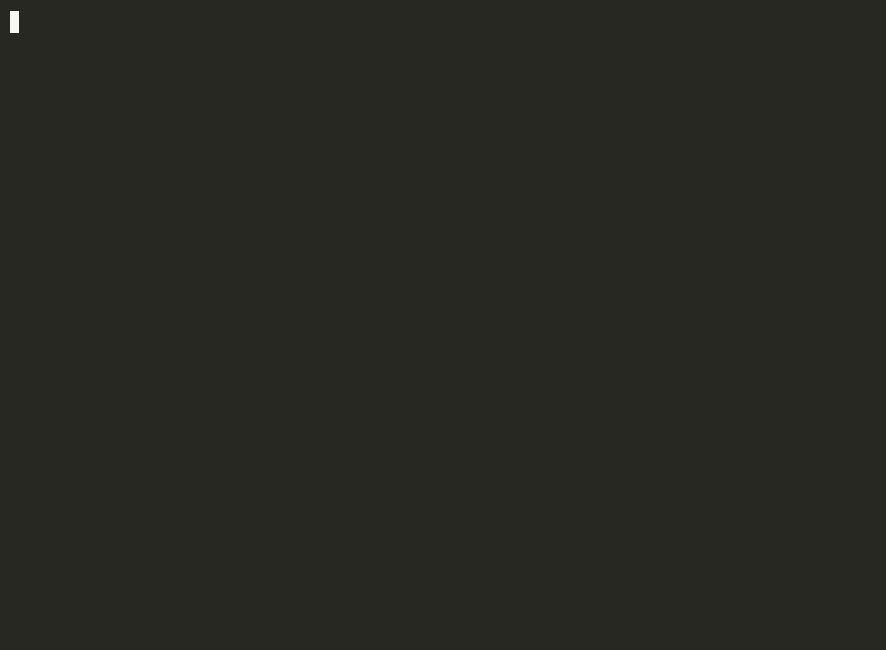
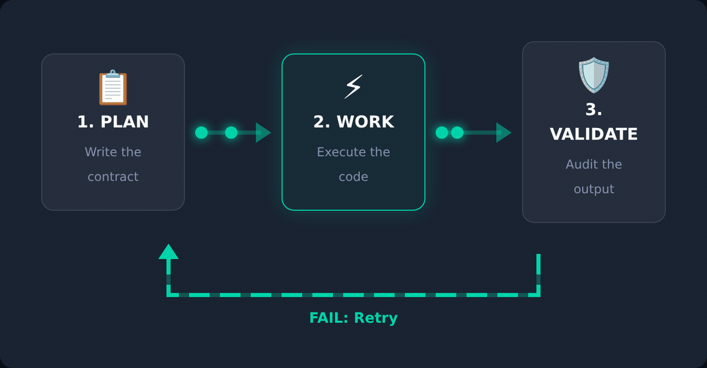
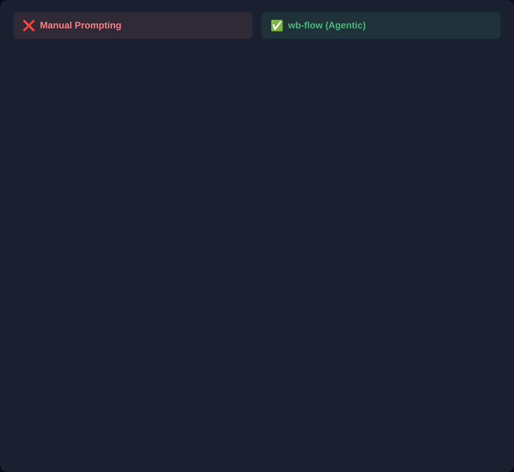
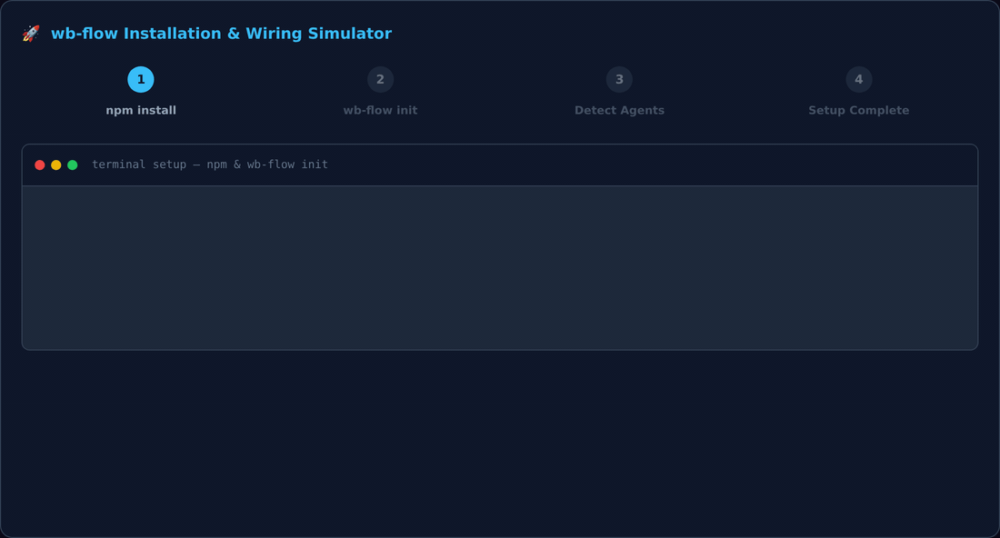
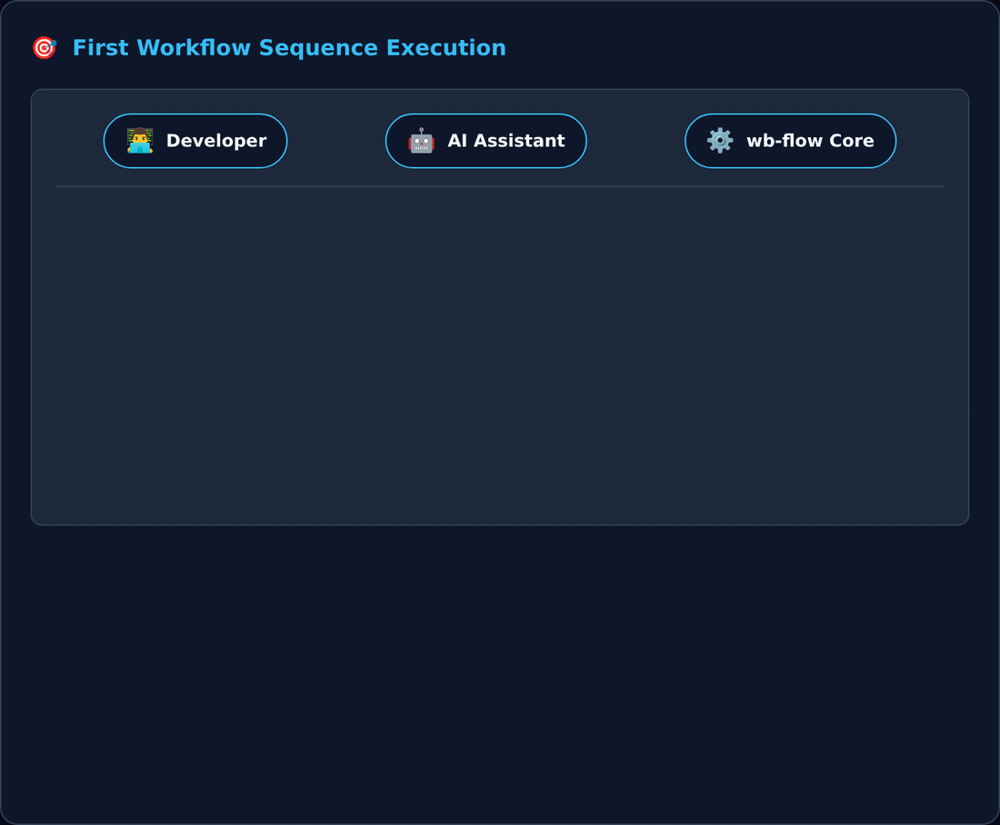
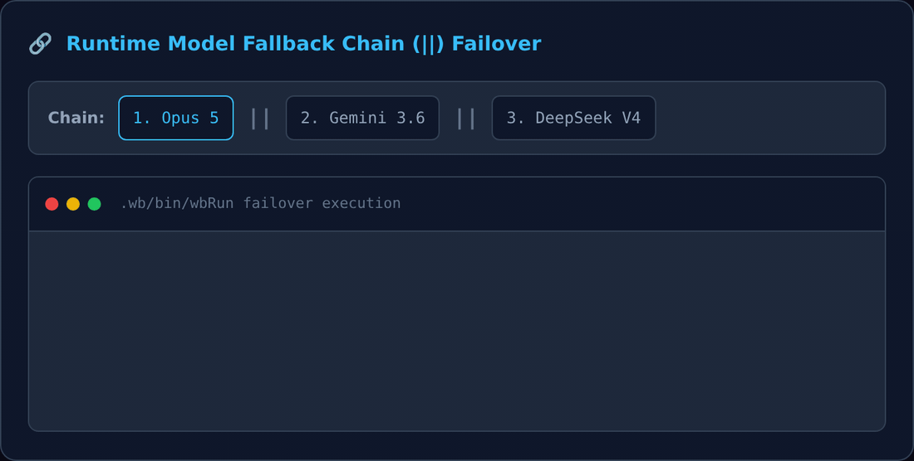

# wb-flow

[](https://badge.fury.io/js/wb-flow)
[](https://opensource.org/licenses/MIT)
[](https://nodejs.org)

> **Your AI assistant is brilliant. It's just undisciplined.**
> wb-flow gives it a spine — 33 strict, verb-driven command templates that turn vague requests into structured, traceable, verifiable work.



> **Framework-agnostic.** wb-flow is a standalone dev tool — works with Vue, React, Python, Go, Rust, or any codebase. Independent of the `wbc-ui` ecosystem (despite the shared author).

---

## The Problem

You give your AI a 3-hour task. Two hours in, it's rewriting files you didn't ask it to touch, skipped the part where it should have audited the codebase first, and committed with `git commit -m "fix stuff"`.

It didn't fail because it's not smart enough. It failed because **nobody gave it a process**.

## The Solution: Verbs, Not Personas

Most AI workflow tools solve this with *personas* — "ask the QA Agent", "invoke the Architect". wb-flow takes a different approach: **verbs over personas.**

You don't ask a role to review your code. You run `/wbAudit`. You don't ask a planner to break down a feature. You run `/wbPlan`. The command *is* the contract.

```
/wbAudit  →  /wbPlan  →  /wbWork  →  /wbValid
  Audit        Plan        Execute     Validate
```

**Audit before you plan. Plan before you execute. Validate before you ship.**



*The same three verbs, as the system runs them: one agent plans, another executes, a **third** verifies. The separation is the point — a model that validates its own diff will call it correct.*

## 🧐 What is it?

wb-flow is a **zero-dependency CLI** that copies 33 structured `/wb*` slash-command templates into your project — pure Markdown files your AI reads and follows as operating procedures.

- **Zero runtime.** No server, no daemon, no Python environment. The tool installs itself and then disappears.
- **Zero lock-in.** Works with Claude Code, Cursor, OpenCode, Gemini CLI, or any assistant that reads a prompt.
- **Zero ambiguity.** Every command has a defined input contract, a defined output format, and a defined handoff to the next step.
- **Universal.** Works with Vue, React, Python, Go, Rust, Terraform — anything with source files.

## 🥊 Compared With...




| Approach | Limitation | wb-flow Advantage |
|---|---|---|
| **Raw AI prompts** | Output depends on the model's mood | Templates rigidly define format, steps, and constraints |
| **Heavy frameworks** (LangChain, AutoGen) | Require Python, API keys, orchestration | Pure Markdown, zero dependencies |
| **Persona-based agents** (BMAD-Method) | Simulate a Scrum team with roleplay | Verbs over personas — tighter, more honest, less drift |

---

## 🚀 Installation




### Path 1 — One-shot via `npx` (Recommended)

```bash
cd my-project/
npx wb-flow
```

### Path 2 — Global install via npm

```bash
npm install -g wb-flow
cd my-project/
wb-flow
```

### Path 3 — Git clone (no npm needed)

```bash
git clone https://github.com/wissemb11/wb-flow.git ~/.wb-flow
cd my-project/
node ~/.wb-flow/bin/install.js
```

### Path 4 — Git clone + `npm link` (for contributors)

```bash
git clone https://github.com/wissemb11/wb-flow.git
cd wb-flow && npm link
cd ~/my-project/
wb-flow         # uses your local clone
```

### Bootstrap flags

- `--force` / `-f` — overwrite existing files (default: skip existing)
- `--dry-run` / `-n` — preview without writing
- `--list` / `-l` — print the bundled command roster and exit
- `--version` / `-v` — print the installed version
- `--help` / `-h` — show usage

By default, `wb-flow` is **non-destructive** — it skips files that already exist. Pass `--force` to overwrite, or `--dry-run` first to preview.

---

## 🔌 Registering `/wb*` in your assistant

Copying the templates puts the *procedures* on disk. To type `/wbPlan src/api` instead of "read this template and run it", your assistant also needs a small command file — one per assistant, in its own format and location. `wb-flow init` writes them for you:

```bash
wb-flow init
```

```text
🚀 wb-flow init — wiring the /wb* commands into your assistants

Where should the /wb* commands be available?
  1) Globally — every project on this machine
  2) This project only — /home/me/my-project
> [1]

Which assistants should get the commands? (detected ones default to Yes)
  Claude Code → ~/.claude/commands [Y/n]
  OpenCode → ~/.config/opencode/command [Y/n]
  Gemini CLI → ~/.gemini/commands [y/N]
  Antigravity (agy) → ~/.gemini/config/skills (skill — agy has no slash-commands) [Y/n]
```

It does both layers in one pass: copies the templates to a stable home, then writes the wrappers.

| Assistant | Location (global / project) | Format |
|---|---|---|
| Claude Code | `~/.claude/commands/` — `.claude/commands/` | `<cmd>.md` + `$ARGUMENTS` |
| OpenCode | `~/.config/opencode/command/` — `.opencode/command/` | `<cmd>.md` + `$ARGUMENTS` |
| Gemini CLI | `~/.gemini/commands/` — `.gemini/commands/` | `<cmd>.toml` + `{{args}}` |
| Antigravity (`agy`) | `~/.gemini/config/skills/` — `.agents/skills/` | one `wb-flow/SKILL.md` dispatcher |
| Cursor | project only — `.cursor/commands/` | `<cmd>.md` |
| Codex | `~/.codex/commands/` — `.codex/commands/` | `<cmd>.md` + `$ARGUMENTS` |

**Scope** decides where the templates live and how wrappers reference them: `global` copies to `~/.wb-flow/` and embeds absolute paths (works from any project); `project` copies to `./.wb/` and embeds relative paths (commit them, and your team gets the commands too).

**Antigravity is the one exception** — it has no user-definable slash-commands (only Rules, Skills, Plugins, Hooks and MCP), so all commands collapse into a single skill activated by natural language: `run wbPlan on src/api`, not `/wbPlan`.

### init flags

```bash
wb-flow init --scope=global --agents=claude,opencode -y   # unattended
wb-flow init --scope=project --agents=all --dry-run       # preview
wb-flow init --agents=detected                            # only installed assistants
wb-flow init --templates=/path/to/templates               # reuse an existing root
```

`--force` overwrites existing wrappers; without it they're skipped. In a non-TTY (CI) `--yes` is required, otherwise init refuses rather than hangs.

### Doing it by hand

Nothing is magic — a wrapper is three lines. If you'd rather not run `init`:

```bash
mkdir -p ~/.claude/commands
TPL="$HOME/.wb-flow/commands"          # or .wb/commands for a project install
printf -- '---\ndescription: Creates a task plan\n---\n\nRead `%s/wbPlan/wbPlan_template.md` and execute it.\n\nArguments / target: $ARGUMENTS\n' "$TPL" \
  > ~/.claude/commands/wbPlan.md
```

And with **no wrapper at all**, in any assistant:

> read `.wb/commands/wbPlan/wbPlan_template.md` and execute it on `src/api`

---

## ⚡ Quick Start




```bash
/wbSetup .                   # Read the codebase — generates context.md + dev.md
/wbPlan "add dark mode"      # Break the goal into a ranked task table
/wbWork --id=1               # Execute the first task, fully traced
/wbValid                     # Verify: does the work match the plan?
```

That's a full cycle: **plan → execute → validate**, guided by your AI assistant.

---

## 🚀 What's New in v1.0.2



*Local error guarding in action: when a provider returns an error **with exit code 0**, the chain now detects it and fails over instead of silently reporting success.*


### New CLI subcommands

`wb-flow` now ships a set of subcommands alongside the `/wb*` slash-command templates —
`init`, `lint`, `model`, `next`, `snap`, `wave`, `watch` and `archive`. The three that changed most in this
release, plus `watch` and `archive` which are new:

- **`wb-flow init`** — one command to install everything: copies templates to a stable home, wires `/wb*` slash-commands into Claude Code, OpenCode, Gemini CLI, Antigravity, and Cursor, and seeds the model roster. Detects installed assistants, offers interactive role-ranking, and writes wrapper files in each assistant's native format. Fully flag-driven for CI (`--scope`, `--agents`, `--yes`).

- **`wb-flow lint`** — check plan files against the output conventions and sync rules to catch structural errors before closing a plan.

- **`wb-flow model`** — the single writer of the model roster. **Detects** credentialed models from every installed CLI (`opencode providers list`, `agy models`, `claude`), ranks them by role with pattern-based preference (newest-version-first, family-collapsed), and writes the result to `commands/model_recommendations.md`. `--pick` (`-i`) opens an interactive tree-picker annotated with **billing pool**, **Model Role Qualification Badges** (🧠, 💻, ⚡, 🔨), and probe results — making visible that three names can be one point of failure. `--probe --all` pre-verifies reachability across the catalog, now supporting multiple modes: `--all` (default) orders reachable models by Role, `--all=raw` streams all results including failures, `--all=<provider>` filters to a specific provider, and `--all=<role>` filters to a specific role — all of which work identically with or without `--pick`. `--set <role>=<slug>`, `--json`, `--dry-run`, `--file=`.

- **`wb-flow next`** — regenerates the `▶️ How to run this plan` block at the bottom of the plan file. It parses the `🌊 Next Executable Sequence` matrix and derives four explicit, non-overlapping execution scenarios. Shell out to it (`wb-flow next <plan.md> --embed`) from any `/wb*` command that alters a plan's state so the run-book stays in sync with the matrix.

- **`wb-flow snap`** — pins the current output into `.wb/snaps/<YYYYMMDD>_<label>/` as a symlink (or a copy with `--snap-copy`) so you can easily find it later. Universal across all `/wb*` commands via the `--snap=<label>` flag.

- **`wb-flow wave`** — the wave orchestration engine. Takes a plan file's `## 🌊 Next Executable Sequence` DAG matrix and converts it into collision-free parallel background dispatches. Routes cells by role: Planner stays in-session with the orchestrator; Worker and Mechanical dispatch to `opencode run` (or `agy`, or the native CLI of whatever model you picked); Validators run in-session unless they pair a row the orchestrator executed. Spawned agents get `--no-plan-update` — they write only their task report; the orchestrator checks the boxes and recomputes the matrix once, after the wave settles.

- **`wb-flow watch`** — live status of the cells a wave left running in the background. Renders per-cell progress as a share of the plan's own `Est. Time (mins)` column, and marks a cell `OVER est Nm by Mm` once it passes that budget — **that**, not raw elapsed time, is what separates *slow* from *hung*. Liveness is read from the process table (`pgrep`), never from log mtime: agents buffer while composing, so an idle log does not mean a dead cell. Three states, never two — `✅/❌` finished, `🔄` running, `⚠️ ENDED` for a cell with no verdict **and** no process (killed or crashed). `-1` for a one-shot snapshot, `--list` for past runs, `--run=` to pick one. It reports what `wave.js` recorded, so treat it as a progress view and confirm outcomes with the row's own `Verify` oracle.

- **`wb-flow archive`** — retires superseded daily reports so a scope's `reports/` tree holds only the *current* file per category. Moves each `<YYYY>/<MM>/<DD>/<category>/` folder — **whole**, because a plan's `tasks/` and `waves/` are its siblings — into `.wb/workflows/archives/` at the **same depth**, so relative links inside the moved files keep resolving unchanged. The newest folder per category is never a candidate, and keepers are resolved *per category*. `standups/` and `tracks/` are exempt: they ARE the log. Every move is banner-stamped, logged, and reversible with `--restore=`. `-n` to preview, `--recursive` for a whole monorepo.


### `.env` loading

`wb-flow model` and `wb-flow init` read a `.env` file from the **current working directory** — your project's, not wb-flow's — falling back to `~/.wb-flow/.env` when the working directory has none. They load only keys matching a known provider prefix (`GROQ_`, `OPENROUTER_`, `ANTHROPIC_`, `OPENAI_`, `GEMINI_`, …) into the environment. Those values are inherited by the agent CLIs wb-flow spawns (`claude`, `agy`, `opencode`, `codex`), which is the point: wb-flow itself never reads an API key. Keys outside the prefix list are skipped and counted on stderr. Extend with `WB_FLOW_ENV_ALLOW="MYVENDOR_"`; restore the old load-everything behaviour with `WB_FLOW_ENV_ALL=1`. **wb-flow does not add `.env` to your `.gitignore` — check that yourself.**

A template ships at `templates/.env.example` with every provider key name and blank values — copy it to `~/.wb-flow/.env` (global) or `./.env` (per-project, takes precedence) and fill in the providers you actually use. Leave a key blank to skip that provider.

### Model configuration files

`models.json` is the **catalog** (which models exist, and the `provider` that decides their CLI). Its default ships in the package and `wb-flow init` copies it to `~/.wb/models.json` — only if absent, so your edits survive upgrades. `selected.json` is your **picked roster** in priority order, written by `wb-flow model --pick`; it is generated, not shipped. Both are plain JSON and meant to be hand-edited — add a provider, reorder a chain, swap a model. `--wave` dispatches each role's chain left to right (`model1 || model2 || model3`), reading the **most recently written** `commands/model_recommendations.md`. See [docs/commands/wbModel/README.md](docs/commands/wbModel/README.md#-the-three-model-files--and-editing-them-by-hand).

> ⚠️ **`wb-flow model --show` and `wb-flow wave` can report different rosters.** `--show` reads the first roster file in the current directory; `wave` reads the most recently written one across the package root, repo root and `~/.wb-flow/`. For what a wave will actually dispatch, use `wb-flow wave <plan.md> --wave=<L> --list` — it prints `📋 Roster in effect:` with the resolved file and the full chain per role. Details: [wbModel/README.md](docs/commands/wbModel/README.md#-the-three-model-files--and-editing-them-by-hand).

### Consolidate, then archive

Passing an existing output file with no other flags now means **"make this the one file I have to read"**:

```bash
/wbPlan  <plan_file.md>                  # absorb every older open task, then repair in place
/wbPlan  <plan_file.md> --archive        # …then retire the plan folders it just emptied
/wbStandup <monorepo-root>/ --archive    # fleet-wide: one live file per category, per scope
```

A month of work leaves thirty plan files, of which one is live. The rest are decoys — and a stale
plan is more dangerous than a missing one, because it answers confidently and wrongly.

> 🔴 **Consolidate always runs before archive.** Archiving first does not delete an open task, it
> makes it *invisible*: nothing live references it, and the next `/wbStandup` no longer scans the tree
> it sits in. Archiving is therefore opt-in and never implied by another flag.

`/wbStandup` and `/wbTrack` are exempt — their value *is* the series, so keeping only the newest
destroys the thing worth reading. `/wbStandup --archive` instead sweeps everything else.
See [Report Lifecycle](docs/concepts/report_lifecycle.md).

### Streaming & session reuse

- **`--summary`** (on by default in wave mode) — streams only the decision lines (`▶` dispatch marker, `G1/G2/G3` gate results, `VERDICT`) to the terminal. Each cell's full output still goes to its log file via `tee`. Measured on a real 10-cell validation wave: **63,002 tokens** streamed without it, of which one cell alone was 16,824 — `ls -la` dumps, ANSI escapes and template reads that no Done box depends on. Pass `--no-summary` to get the full stream while debugging a single cell.

- **`--sessions`** — reuses one warm opencode session per (scope, model). A cold dispatch re-reads its command template and context files every cell; with `--sessions` the session is **resumed and forked** so parallel cells each get their own branch off the same warm base. Opt-in because a resumed session replays its conversation history — measure `opencode stats --days 1 --models` both ways before making it habit.

### 🛡️ `wbRun` dispatch protection

Every background cell spawned by `wb-flow wave` runs through `.wb/bin/wbRun`, a local subshell guard that intercepts **stdout and stderr**, not just exit codes. A model that returns exit 0 with the text `Error: Insufficient credits` is indistinguishable from success by `||` chaining alone. `wbRun` catches fatal API-level strings, displays visual banners (`▶ Executing:` / `❌ Failed:`), and automatically fails over to the next model in the `||` fallback chain. The chain advances **on Gate 1 (Infra) only** — a Gate 2 or Gate 3 retry meets the same wall at double cost, so re-dispatch after those is a human decision.

### The three-gate verdict contract

Every cell dispatched by `wb-flow wave` is classified by three gates — never by its output text:

| Gate | Question | Signal |
|---|---|---|
| **1 · Infra** | did the agent run at all? | CLI exit code, plus anchored fatal patterns (`^Error: Model not found`, rate limit, quota) |
| **2 · Artifact** | did it write what it was required to write? | `tasks/task_<ID>/task_<ID>_report_*.md` exists |
| **3 · Oracle** | does the task's own `Verify` command pass? | `exit 0` |

| G1 | G2 | G3 | Verdict | Done box |
|---|---|---|---|---|
| ✗ | — | — | **INFRA** — never ran | `⬜` |
| ✓ | ✗ | — | **NO-OP** — ran, produced nothing | `⬜` |
| ✓ | ✓ | ✗ | **ATTEMPTED** — needs a validator | `⬜` |
| ✓ | ✓ | ✓ | **DONE** | `✅` |

Output string-matching is forbidden as a success signal. A `/wbWork` log legitimately contains `Error:` and `failed` whenever the task is about error handling — and those are the rows where a false verdict costs most.

### Lighter, self-repairing plan files

A plan file is one authored table plus four derived projections of it — status callout, 🌊 matrix,
how-to-run block, What's Next — regenerated in that order, because each derives from the one before.

- 📝 **Wave notes externalized** to `tasks/waves.md`; the plan keeps a one-line pointer. Notes grow every wave — inline, they push the task table below a screen of prose about waves that already ran.
- ▶️ **How-to-run block relocated** to sit directly beneath the 🌊 matrix table it is computed from.
- 🔗 **Multi-ID merged dispatches** — cells sharing a wave, scope, role and model merge into `--id=5,6`: one context read instead of N, with per-ID gating preserved. *Batching yields to executor≠validator, never the reverse* — two validate cells sharing a model must not merge if their ids had different executors, or the merged verdict silently self-validates.
- 🌊 **`--wave=A` means work then validate** (`A.work` → `A.valid`), so a wave is a complete unit rather than a promise redeemed a wave later. One label per invocation — `--wave=C,D` does not exist.
- 📋 **Four copy/paste scenarios** below every matrix, individual dispatches always carrying an explicit `-M="…"`.
- ✅ **The sync oracle** (`sync_check.sh`) exits non-zero and names the derived block that drifted. A plan that fails it is not slightly out of date — it is actively misleading, and every downstream dispatch inherits the error.
- 👀 **`wb-flow watch` shows the task `#id` and description**, not just the model — a glance answers "which of the four is the slow one". `/wbWork` closes with a continuation signoff so the screen shows work is live rather than looking idle.

### Other additions

- 🎛️ **Universal model flags** (`--planner`, `--worker`, `--validator`, `--mechanical`, `--model`) accepted by every `/wb*` command. Role flags persist (equivalent to running `/wbModel` first). `-M="<model>"` delegates a single invocation and outranks everything.
- ⚡ **Autonomous Wave Auto-Pilot (`-y` / `--yes`)**: Zero-touch background execution and wave script spawning.
- 📌 **Persistent Model Rosters & Matrix Auto-Correction**: Embeds model rosters in plan matrix headers and repairs missing matrices on `/wbPlan` or `/wbWork`.
- 📚 **Uniform 9-File Docs Suite**: Complete 9-file suite across all 33 commands (306 files).

See the full [What's New Guide](docs/new.md) and [Detailed Technical Release Notes](docs/detailed_news.md).

---

## 📚 Full Documentation

The complete reference — all 33 commands, workflow concepts, daily use patterns, and session lifecycle — is available in two places:

* **[→ What's New in v1.0.2](docs/new.md)** — concise summary of release features
* **[→ Detailed Technical Guide](docs/detailed_news.md)** — comprehensive code & terminal examples
* **[→ GitHub Docs](docs/README.md)** — browse the full documentation hub
* **[→ flow.wbc-ui.com](https://flow.wbc-ui.com)** — the dedicated documentation website

---

## 🐕 Built With wb-flow

This documentation — all 250+ files, 33 command references, and concept pages — was itself planned, audited, and validated using `wb-flow`. Every task was tracked via `/wbPlan`, every page was scored via `/wbAudit`, and every commit was generated via `/wbGit`. The tool eats its own cooking.

---

## 👨‍💻 About the Owner & Resources

**wb-flow** is created and maintained by **Wissem Boughamoura**.

* 🐙 **GitHub:** [@wissemb11/wb-flow](https://github.com/wissemb11/wb-flow)
* 📦 **npm:** [wb-flow](https://www.npmjs.com/package/wb-flow)
* 📚 **Documentation:** [flow.wbc-ui.com](https://flow.wbc-ui.com) · [GitHub Docs](https://github.com/wissemb11/wb-flow/tree/main/docs)
* 👤 **Author:** [Wissem Boughamoura](https://github.com/wissemb11) — `wissemb11@gmail.com`

### 📬 Contact & Support

* Bugs / feature requests → [GitHub Issues](https://github.com/wissemb11/wb-flow/issues)
* General questions → email `wissemb11@gmail.com`

---

*License: MIT © 2026 Wissem Boughamoura. See [LICENSE](LICENSE).*
*Changelog: see [CHANGELOG.md](CHANGELOG.md).*
