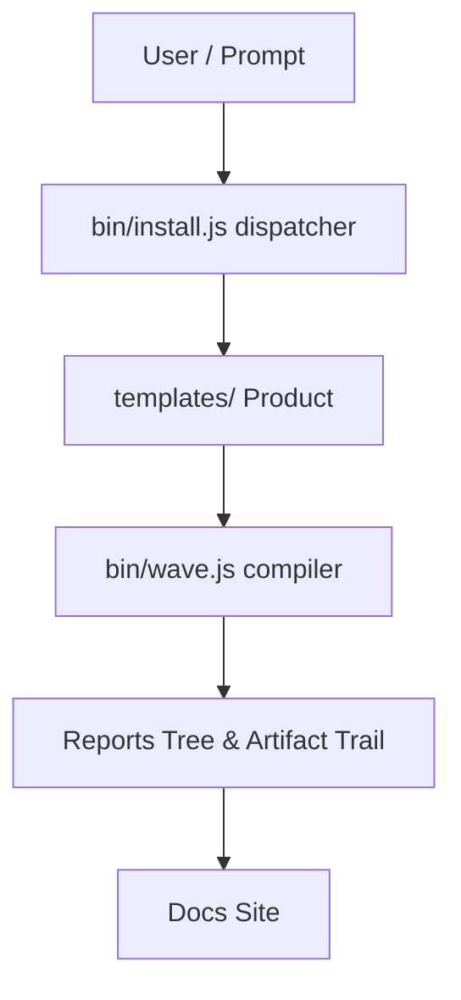

# wb-flow Architecture

The wb-flow tool acts as an orchestrator and control plane for AI coding. Its core components include:

- **`templates/`**: The core product containing templates for `/wbPlan`, `/wbWork`, `/wbExplain`, etc.
- **`bin/install.js`**: The dispatcher that bootstraps the system into any repo.
- **`bin/wave.js`**: The matrix compiler responsible for executing plans in parallel waves.
- **Reports Tree**: `.wb/workflows/reports/` where the artifact trail is built, connecting requirement to plan, task, execution, and validation.
- **Docs Site**: The documentation interface (flow.wbc-ui.com).

## Architecture Diagram

