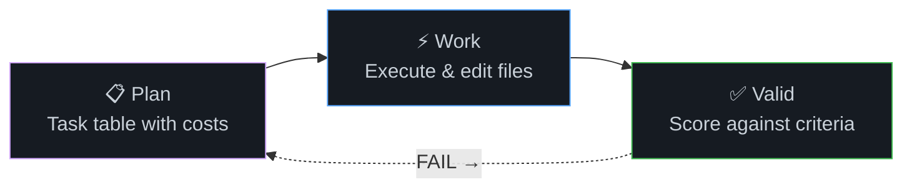

# Commands

The 33 `/wb*` agentic commands are organized into **eight functional families**. Each family covers a distinct phase of the software lifecycle — from understanding context to shipping production code.

---

## Family Overview

| Family | Commands | What They Do |
|---|---|---|
| **Context Builders** | `/wbSetup`, `/wbContext` | Initialize agent identity and scan project state |
| **Planners** | `/wbPlan`, `/wbAudit`, `/wbReview` | Break goals into tasks, audit quality, and review changes |
| **Workers** | `/wbWork`, `/wbRefactor`, `/wbDoc`, `/wbDebug` | Execute tasks, restructure code, generate docs, and diagnose errors |
| **Critics** | `/wbTest`, `/wbValid`, `/wbCheck` | Verify correctness through tests, validation, and pre-flight checks |
| **Surgeons** | `/wbClean`, `/wbLicense`, `/wbSecure`, `/wbTranslate` | Remove dead code, license compliance, scan vulnerabilities, and internationalize |
| **Shippers** | `/wbRelease`, `/wbPublish`, `/wbDeploy` | Bump versions, publish packages, and deploy to hosts |
| **Archivists** | `/wbTrack`, `/wbStopTrack`, `/wbLog`, `/wbStandup` | Session tracking, finalization, logging, and cross-project status |
| **Strategists** | `/wbVision`, `/wbIdea`, `/wbNext`, `/wbExplain`, `/wbBroadcast`, `/wbHelp`, `/wbMonetize`, `/wbActOn`, `/wbGit`, `/wbToWBC` | Roadmap planning, idea capture, next-step prediction, explanations, announcements, help, monetization, action ranking, commit messages, and code conversion |

---

## Command Directory

| # | Command | Family | Hub |
|---|---|---|---|
| 01 | [`/wbSetup`](wbSetup/README.md) | Context Builders | [Hub](wbSetup/README.md) |
| 02 | [`/wbContext`](wbContext/README.md) | Context Builders | [Hub](wbContext/README.md) |
| 03 | [`/wbPlan`](wbPlan/README.md) | Planners | [Hub](wbPlan/README.md) |
| 04 | [`/wbAudit`](wbAudit/README.md) | Planners | [Hub](wbAudit/README.md) |
| 05 | [`/wbReview`](wbReview/README.md) | Planners | [Hub](wbReview/README.md) |
| 06 | [`/wbWork`](wbWork/README.md) | Workers | [Hub](wbWork/README.md) |
| 07 | [`/wbRefactor`](wbRefactor/README.md) | Workers | [Hub](wbRefactor/README.md) |
| 08 | [`/wbDoc`](wbDoc/README.md) | Workers | [Hub](wbDoc/README.md) |
| 09 | [`/wbDebug`](wbDebug/README.md) | Workers | [Hub](wbDebug/README.md) |
| 10 | [`/wbTest`](wbTest/README.md) | Critics | [Hub](wbTest/README.md) |
| 11 | [`/wbValid`](wbValid/README.md) | Critics | [Hub](wbValid/README.md) |
| 12 | [`/wbCheck`](wbCheck/README.md) | Critics | [Hub](wbCheck/README.md) |
| 13 | [`/wbClean`](wbClean/README.md) | Surgeons | [Hub](wbClean/README.md) |
| 14 | [`/wbLicense`](wbLicense/README.md) | Surgeons | [Hub](wbLicense/README.md) |
| 15 | [`/wbSecure`](wbSecure/README.md) | Surgeons | [Hub](wbSecure/README.md) |
| 16 | [`/wbTranslate`](wbTranslate/README.md) | Surgeons | [Hub](wbTranslate/README.md) |
| 17 | [`/wbRelease`](wbRelease/README.md) | Shippers | [Hub](wbRelease/README.md) |
| 18 | [`/wbPublish`](wbPublish/README.md) | Shippers | [Hub](wbPublish/README.md) |
| 19 | [`/wbDeploy`](wbDeploy/README.md) | Shippers | [Hub](wbDeploy/README.md) |
| 20 | [`/wbTrack`](wbTrack/README.md) | Archivists | [Hub](wbTrack/README.md) |
| 21 | [`/wbStopTrack`](wbStopTrack/README.md) | Archivists | [Hub](wbStopTrack/README.md) |
| 22 | [`/wbLog`](wbLog/README.md) | Archivists | [Hub](wbLog/README.md) |
| 23 | [`/wbStandup`](wbStandup/README.md) | Archivists | [Hub](wbStandup/README.md) |
| 24 | [`/wbVision`](wbVision/README.md) | Strategists | [Hub](wbVision/README.md) |
| 25 | [`/wbIdea`](wbIdea/README.md) | Strategists | [Hub](wbIdea/README.md) |
| 26 | [`/wbNext`](wbNext/README.md) | Strategists | [Hub](wbNext/README.md) |
| 27 | [`/wbExplain`](wbExplain/README.md) | Strategists | [Hub](wbExplain/README.md) |
| 28 | [`/wbBroadcast`](wbBroadcast/README.md) | Strategists | [Hub](wbBroadcast/README.md) |
| 29 | [`/wbHelp`](wbHelp/wbHelp.md) | Strategists | [Hub](wbHelp/wbHelp.md) |
| 30 | [`/wbMonetize`](wbMonetize/README.md) | Strategists | [Hub](wbMonetize/README.md) |
| 31 | [`/wbActOn`](wbActOn/README.md) | Strategists | [Hub](wbActOn/README.md) |
| 32 | [`/wbGit`](wbGit/wbGit.md) | Strategists | [Hub](wbGit/wbGit.md) |
| 33 | [`/wbToWBC`](wbToWBC/README.md) | Strategists | [Hub](wbToWBC/README.md) |

---

## How to Navigate

- **New to the system?** Start with [`/wbSetup`](wbSetup/README.md) and the [Start Here](../start_here/README.md) guide.
- **Need to plan work?** See the [Planners](#planners) family or read [`/wbPlan`](wbPlan/README.md) directly.
- **Looking for daily workflows?** Visit [Daily Use](../daily_use/README.md).
- **Session management?** Read [Session Lifecycle](../session_lifecycle/README.md).

---

← [Home](../README.md) · [Concepts](../concepts/README.md) · [Install](../../README.md) | [@wbc-ui2/wb-flow on npm](https://www.npmjs.com/package/@wbc-ui2/wb-flow) · [flow.wbc-ui.com](https://flow.wbc-ui.com) · [wi-bg.com](https://www.wi-bg.com)
