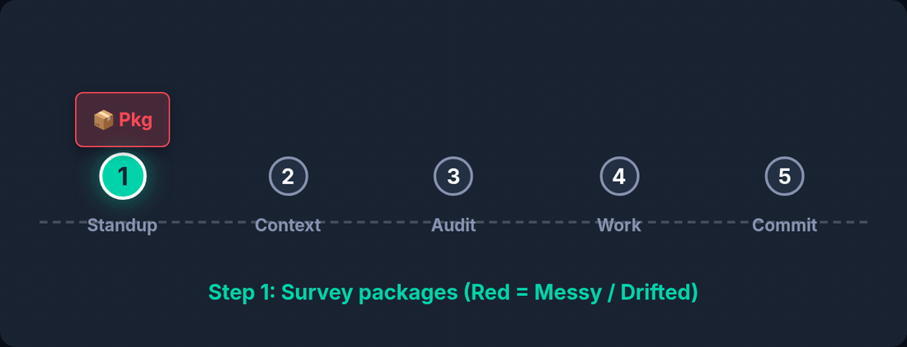

# /wbAudit — Command Hub

`/wbAudit` is the WB-Labs honesty engine. It reads **actual source files** — not summaries, not plans — and returns a scored, ranked assessment of whether code is ready to ship. It is the command you run *before* `/wbRelease`, not after something breaks.



*`/wbAudit` finds the gap between what a scope claims and what it does — then the plan it emits is what closes it.*

## 🎯 Strategic Position

Every other command in the suite tells you what to *do*. `/wbAudit` tells you where you actually **are**. That distinction matters because the default failure mode of an AI reviewer is agreeableness — *"looks good overall, minor improvements possible"* — which is always wrong for a non-trivial package. Every active package has at least one MAJOR finding.

- **Before a release** — a folder audit on the package being shipped.
- **After inheriting code** — a baseline of the debt you just took on.
- **Before a refactor** — a file audit on the file you are about to change.

## 🛠️ Operating Modes

| Mode | Trigger | Output |
|---|---|---|
| **Strategic** | `/wbAudit <folder>` | Score /10, findings ranked BLOCKER / MAJOR / MINOR, ship recommendation |
| **Surgical** | `/wbAudit <file>` | Flaws in one file, plus an existing-vs-suggested comparison table |
| **Self-correct** | `/wbAudit <previous_audit.md>` | Verifies and repairs the prior report in place |

## ✅ What a useful audit contains

A useless audit is missing at least one of these five:

1. A **score** with a ship / don't-ship recommendation.
2. Findings **ranked by severity**.
3. Specific **file and line references**.
4. A **"what this audit did NOT check"** section.
5. The **next command** to run.

If any is absent, re-run it with *"harsher."*

## 🚫 What it cannot do

| Not this | Use instead |
|---|---|
| Runtime performance | [`/wbTest --profile`](../wbTest/README.md) |
| Adversarial security | [`/wbSecure`](../wbSecure/README.md) |
| Whether a feature *should* exist | [`/wbVision`](../wbVision/README.md) |
| Why something is broken | [`/wbDebug`](../wbDebug/README.md) |
| Verifying one specific change | [`/wbReview`](../wbReview/README.md) |

It also **surfaces** open architectural decisions rather than resolving them. An audit describes reality; it does not choose your architecture.

## 📚 Reading Order

1. **[ELI5](wbAudit_eli5.md)** — the one-paragraph mental model.
2. **[Practical](wbAudit_practical.md)** — the two modes and when each applies.
3. **[Expert](wbAudit_expert.md)** — why severity ranking beats a single score.
4. **[Examples](wbAudit_examples.md)** — annotated audit transcripts.
5. **[Exhaustive simulation](wbAudit_exhaustive_simulation.md)** · **[Live demo](wbAudit_live_demo.md)**.

## 🔗 Related

- [`wbAudit.md`](wbAudit.md) — the command reference this hub orients you around.
- [`/wbActOn`](../wbActOn/README.md) — turns an audit into a ranked execution order.
- [`/wbPlan`](../wbPlan/README.md) — turns audit findings into a task table.
- [`/wbNext`](../wbNext/README.md) — ranks what to do once an audit lands.

## Quick Reference

```bash
/wbAudit packages/wb-core/            # strategic: score + ranked findings
/wbAudit packages/wb-core/src/WBC.js  # surgical: one file
/wbAudit <folder> --act               # chain into /wbActOn
/wbAudit <folder> --wbPlan            # chain into plan generation
/wbAudit <folder> --ideas             # route P3 findings to the idea pipeline
```

---

---

← [Home](../../README.md) · [Commands](../../README.md#the-command-catalog) · [Install](../../../README.md) | [wb-flow on npm](https://www.npmjs.com/package/wb-flow) · [flow.wbc-ui.com](https://flow.wbc-ui.com) · [wi-bg.com](https://www.wi-bg.com)
