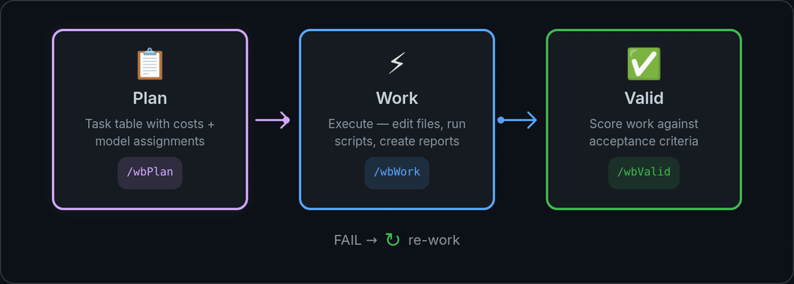

# `/wbPlan` Documentation Hub

Welcome to the official documentation hub for `/wbPlan` in **wb-flow**.



*`/wbPlan` produces the table the other two verbs consume. The loop above is the contract: every row it writes carries a `Verify` oracle and a validator who is **not** the executor — a FAIL sends the row back to `⬜`, it does not lower the bar.*

## Overview
`/wbPlan` is the architectural planning engine of **wb-flow**. It breaks user goals into prioritized, cost-aware task tables (`plan_<scope>.md`) and constructs the `## 🌊 Next Executable Sequence` matrix for parallel wave execution.


### 💡 `--as` Explanation Gate Behavior
- **Standard Invocations (without `--as`)**: Matrix task cells contain **ONLY** the direct execution command:
  ```markdown
  `/wbWork plan.md --id=B23`<br>→ *DeepSeek V4 Pro* *(⏱️ 15 min)*
  ```
- **Explanation-Enabled Invocations (with `--as="<style>"`)**: Matrix task cells prepend `/wbExplain`:
  ```markdown
  `/wbExplain plan.md --id=B23 --as="expert,steps"`<br>`/wbWork plan.md --id=B23`<br>→ *DeepSeek V4 Pro* *(⏱️ 15 min)*
  ```


### ⏱️ Wave Execution Session Tracking (`/wbTrack`)
Whenever `/wbWork` or `/wbPlan` is executed with the `--wave=<label>` flag, the execution pipeline automatically wraps the wave dispatches with session tracking:

```bash
# Executing /wbWork <path_scope> --wave=A follows this sequence:
1. /wbTrack <path_scope>   # Starts/joins today's session tracking log
2. wave_A.sh dispatches     # Executes parallel wave tasks
3. /wbTrack --stop          # Stops and finalizes session tracking log
```


### 🚀 Next Wave Execution Command Suggestions
Below the `## 🌊 Next Executable Sequence` matrix and Wave notes, `/wbPlan` and `/wbWork` output a dedicated recommendation block calculating total estimated duration (`Est. Time`) and offering ready-to-run CLI commands tailored for time and cost considerations:

- **Option 1 (Next Wave)**: `.wb/bin/wbRun claude -p --permission-mode auto "/wbWork plan.md --wave=A -y"`
- **Option 2 (With `--as`)**: `.wb/bin/wbRun claude -p --permission-mode auto "/wbWork plan.md --wave=A --as="expert,steps" -y"`
- **Option 3 (All Waves)**: `.wb/bin/wbRun claude -p --permission-mode auto "/wbWork plan.md --wave=all -y"`

## Flag Effects & Capabilities
- **`--planner="<models>"` / `-p`**: Sets Planner model fallback chain for all waves in the plan.
- **`--validator="<models>"` / `-v`**: Sets Validator model fallback chain.
- **`--worker="<models>"` / `-w`**: Sets Worker model fallback chain.
- **`--mechanical="<models>"` / `-m`**: Sets Mechanical helper model fallback chain.
- **Open Task Unification**: Automatically scans prior plans in `<path_folder>/.wb/workflows/reports/` for open tasks (`☐ Done` or `☐ Valid` is `⬜`) and ships them into the primary plan file (`plan_<scope>_<date>.md`).
- **Matrix Auto-Correction & Enforce**: Guarantees the `## 🌊 Next Executable Sequence` matrix section exists and updates it to schedule the **WHOLE set of unified open tasks** across execution waves.
- **Top-Level Plan Status**: Displays `> **Status:** 🟢 OPEN (<N> open tasks)` or `> **Status:** ✅ CLOSED (All tasks completed & validated)` under the plan header, updated on every pass.
- **Dynamic "🧭 What's Next?" Section**: Recomputed dynamically whenever the plan file is updated or tasks are executed to present live progress and next steps.
- **Model Header Persistence**: Embeds `> **Active Model Roster for this Plan:**` into the plan header for future `/wbWork` dispatches.

## Standard 9-File Documentation Suite
1. [`wbPlan.md`](wbPlan.md) — Complete `/wbPlan` specification & flag reference.
2. [`wbPlan_eli5.md`](wbPlan_eli5.md) — Plain-language explanation of planning & matrices.
3. [`wbPlan_examples.md`](wbPlan_examples.md) — Standard plan creation & task filtering.
4. [`wbPlan_examples.md`](wbPlan_examples.md) — Model roster overrides, matrix auto-correction, & wave scheduling.
5. [`wbPlan_exhaustive_simulation.md`](wbPlan_exhaustive_simulation.md) — Simulation of plan creation and matrix generation.
6. [`wbPlan_expert.md`](wbPlan_expert.md) — DAG dependency scheduling & cost estimation formulas.
7. [`wbPlan_live_demo.md`](wbPlan_live_demo.md) — Terminal log snapshot of `/wbPlan` execution.
8. [`wbPlan_practical.md`](wbPlan_practical.md) — Multi-package planning recipes & backlog management.


### ⏱️ Matrix Task Duration Estimations
In the `## 🌊 Next Executable Sequence` matrix table, each task dispatch cell appends the estimated task duration extracted from the task table's `Est. (min)` column, formatted as `*(⏱️ <min> min)*`:

```markdown
`/wbWork plan.md --id=B23`<br>→ *DeepSeek V4 Pro* *(⏱️ 15 min)*
```


### 💡 Pre-Flight Explanation Blueprint Gate (`--as`)
- **Standard Mode (default, without `--as`)**: Matrix cells contain **ONLY** the direct execution command:
  ```markdown
  `/wbWork plan.md --id=B23`<br>→ *DeepSeek V4 Pro* *(⏱️ 15 min)*
  ```
- **Explanation Mode (with `--as="<style>"`)**: Matrix cells prepend `/wbExplain`:
  ```markdown
  `/wbExplain plan.md --id=B23 --as="expert,steps"`<br>`/wbWork plan.md --id=B23`<br>→ *DeepSeek V4 Pro* *(⏱️ 15 min)*
  ```

## 🎛️ Universal model flags *(2026-08-01)*

| Flag | Alias | Effect |
|---|---|---|
| `--planner=` | `-p` | 🧠 Planner chain — **persists** via `/wbModel` |
| `--validator=` | `-v` | ✅ Validator chain — persists |
| `--worker=` | `-w` | 🔨 Worker chain — persists. ⚠️ `-w` is **not** `--wave` |
| `--mechanical=` | `-m` | 📋 Mechanical chain — persists |
| `--model=` | `-M` | **Delegate this run.** Highest priority: outranks role routing, the roster and the executor≠validator rule |
| `--wave=<L>:<R>` | `-W` | Run **one cell** — `:P` Planner · `:V` Validator · `:W` Worker · `:M` Mechanical |

```bash
/wbWork <folder>/ --wave="A:W" -M=$WORKER      # one cell, delegated
/wbValid <folder>/ --id="<i>" -v="go:ds4pro"           # persists the validator roster, then runs
```

Role flags are shorthand for running `/wbModel` first. An unknown role letter in `--wave` exits non-zero rather than silently running the whole row. **Precedence:** `-M` → role flag → plan-header roster → `model_recommendations.md` → defaults.

After the 🌊 matrix, a **copy/paste block** of bare runnable commands is printed — no table markup, no `<br>`, no duration annotations.
