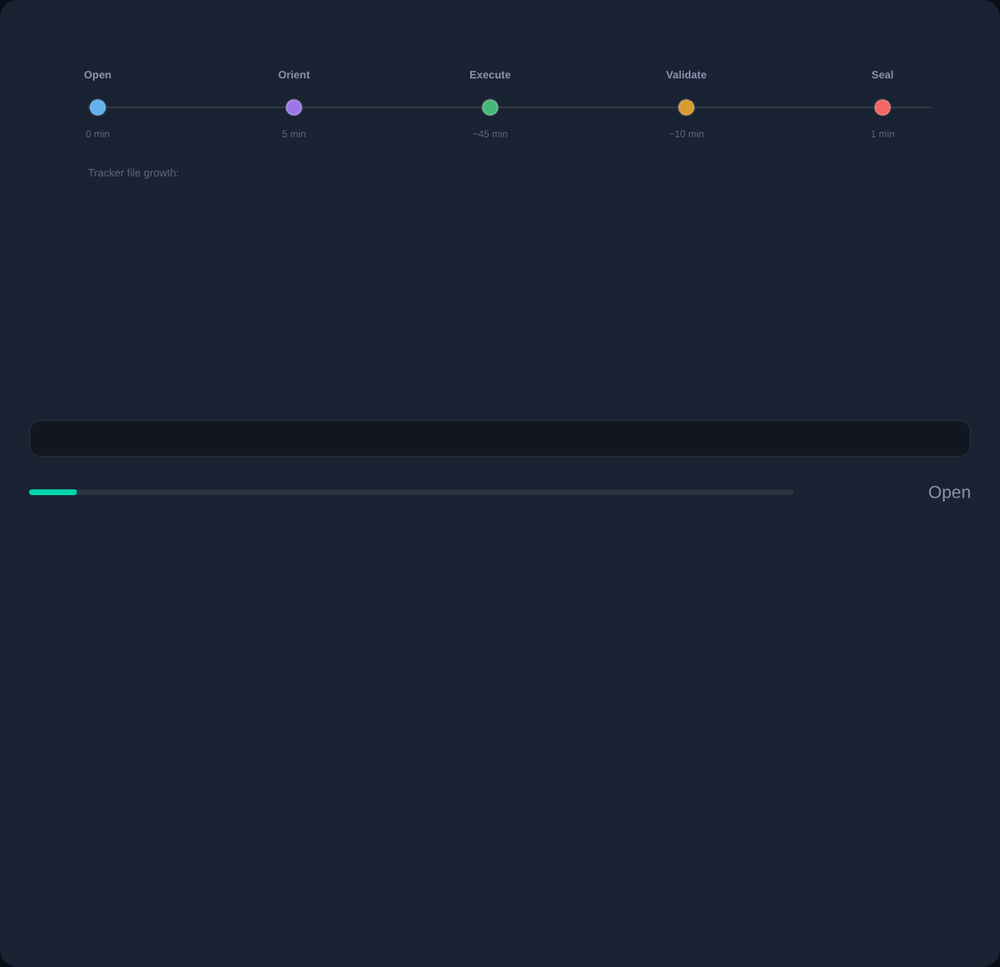

# /wbTrack — Command Hub

`/wbTrack` initializes a session tracking file that records every `/wb*` command invocation, creating a timestamped narrative of the work session. It captures the command, target, outcome, branch, task context, and billing metadata — the audit trail that `/wbStandup` and `/wbNext` depend on.



*`/wbTrack` opens the session narrative that `/wbStopTrack` closes — the two ends of the same arc.*

## 🎯 Strategic Position

`/wbTrack` is the session diary of the `wb-flow` system. Without it, `/wbStandup` has nothing to summarize and `/wbNext` has no history to learn from. Run it at the start of every work session so downstream commands can produce accurate summaries and informed recommendations.

- **Starting work** — `/wbTrack` begins the session diary.
- **Scoping a session** — `--scope` ties entries to a task or context.
- **Finishing** — `--finalize` closes the session cleanly.

## 🛠️ Operating Modes

| Mode | Trigger | Output |
|---|---|---|
| **Start** | `/wbTrack` | Session tracking file initialized with timestamp and branch |
| **Scoped** | `/wbTrack --scope <name>` | Session scoped to a specific task or project context |
| **Finalize** | `/wbTrack --finalize` | Session closed and finalized, ready for `/wbStandup` |

## ✅ What a useful tracking session contains

A useful tracking session records at minimum:

1. **Timestamped entries** for each `/wb*` command invocation.
2. **Branch and project context** captured per entry.
3. **Task linkage** — each command mapped to its originating task.
4. **Billing metadata** for time-tracking and reporting.

## 🚫 What it cannot do

| Not this | Use instead |
|---|---|
| Summarize the session | [`/wbStandup`](../wbStandup/README.md) |
| Stop tracking | [`/wbStopTrack`](../wbStopTrack/README.md) |
| Plan work | [`/wbPlan`](../wbPlan/README.md) |

## 📚 Reading Order

1. **[ELI5](wbTrack_eli5.md)** — the one-paragraph mental model.
2. **[Practical](wbTrack_practical.md)** — step-by-step walkthrough on a real project.
3. **[Expert](wbTrack_expert.md)** — architecture, edge cases, and when NOT to use.
4. **[Examples](wbTrack_examples.md)** — annotated transcripts ([Part 1](wbTrack_examples.md), [Part 2](wbTrack_examples.md)).
5. **[Exhaustive simulation](wbTrack_exhaustive_simulation.md)** · **[Live demo](wbTrack_live_demo.md)**.

## 🔗 Related

- [`wbTrack.md`](wbTrack.md) — the command reference this hub orients you around.
- [`/wbStandup`](../wbStandup/README.md) — generate a summary from tracked sessions.
- [`/wbStopTrack`](../wbStopTrack/README.md) — close the current tracking session.
- [`/wbPlan`](../wbPlan/README.md) — plan work for the tracked session.

## Quick Reference

```bash
/wbTrack                       # start a session tracking file
/wbTrack --scope feature-x     # start with a named scope
/wbTrack -s fix-auth           # shortcut for --scope
/wbTrack --finalize            # close and finalize the session
/wbTrack -f                    # shortcut for --finalize
```

---
---
← [Home](../../README.md) · [Commands](../../README.md#the-command-catalog) · [Install](../../../README.md) | [wb-flow on npm](https://www.npmjs.com/package/wb-flow) · [flow.wbc-ui.com](https://flow.wbc-ui.com) · [wi-bg.com](https://www.wi-bg.com)
