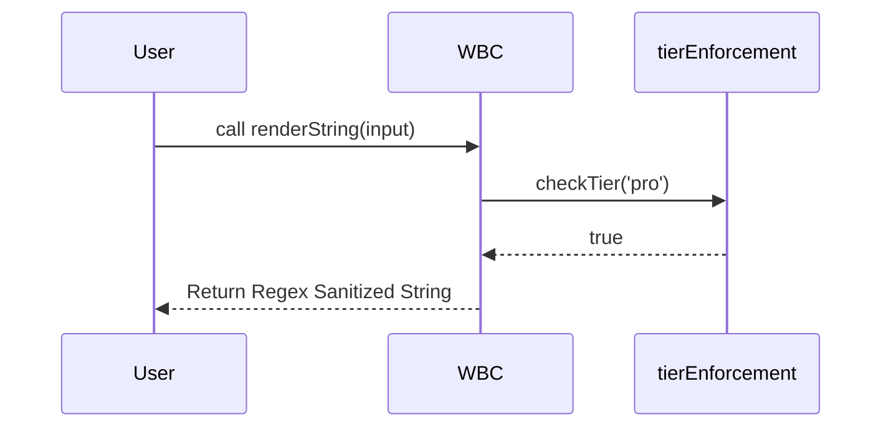

# wb-flow Protocol: /wbVision Live Workspace Demo

This document is the **Real-Time Execution Log** of the `/wbVision` command. It applies the exact structural matrix from the Exhaustive Simulation to the *current, live state* of the `wb-labs` workspace as of 2026-05-04.

---

## 1. Role & Definition Matrix (Live Application)
**Target:** `wb-labs/frontEnd/wbc-ui/core2`
**Live State Evaluated:** 
*   Active Directory: `core2`
*   Status: The developer wants to visualize how the consumer apps (`apps/wbc-ui.com`) interact with the internal dependencies (`packages/wb-core`).

| Scenario | Live System Behavior (wb-labs) |
|---|---|
| Target is Directory | **[ACTIVE]** System is primed to trace `import` statements across `core2`. |
| Target is Database Schema | **[INACTIVE]** `core2` has no backend ORM (Prisma/TypeORM) files. |
| Codebase Too Large | **[PASS]** The monorepo component count is manageable. Tracing can proceed. |

---

## 2. Argument & Criteria Resolution Matrix (Live Application)
| Argument Type | Input Executed | Live Parsed State (wb-labs) | Live Output Generation |
|---|---|---|---|
| Specific Logic File | `Command: /wbVision packages/wb-core/src/WBC.js` | Locks onto monolith. | `[PROCEED] Mapping internal flowchart of WBC class methods.` |
| Directory Path | `Command: /wbVision apps/wbc-ui.com` | Analyzes consumer app. | `[PROCEED] Drawing component tree for main UI app.` |
| Comma-Separated | `Command: /wbVision apps/demo,packages/wb-core` | Correlates scopes. | `[PROCEED] Generating boundary map between demo app and core lib.` |
| Wildcard Glob | `Command: /wbVision packages/**/*.js` | Massive sweep. | `[PROCEED] Creating massive dependency graph for all local libraries.` |

---

## 3. Flag Processing Matrix (Isolated Live Runs)

| Flag | Live Executed Command | Live Output Impact |
|---|---|---|
| `--type="<format>"`| `Command: /wbVision packages/wb-core -t="class"` | `[TYPE] Extracting class definitions from WBC.js and tierEnforcement.js.` |
| `--output="<path>"`| `Command: /wbVision packages/ -o="architecture.md"` | `[OUTPUT] Appended Mermaid block to core2/architecture.md.` |
| `--render` | `Command: /wbVision packages/wb-core -r` | `[RENDER] Failed. Headless Chrome not installed in local environment.` |
| `--depth="<N>"` | `Command: /wbVision apps/ -d="2"` | `[DEPTH] Limiting trace to top-level app components and index pages.` |

---

## 4. Omni-Channel Execution Pipeline (Live Chaining)

### 💠 The "Massive Monorepo Mapping" (`apps/,packages/ -t="flowchart" -o="docs/arch.md"`)
**Live Context:** Running this *right now* to create a high-level dependency map of the `wb-labs` UI ecosystem for the new v4 README.
**Command Executed:** `/wbVision apps/,packages/ -t="flowchart" -o="docs/arch.md"`
**Live Output:**
```text
> Command: /wbVision apps/,packages/ -t="flowchart" -o="docs/arch.md"

[SYSTEM] Initiating Monorepo Architectural Map...
[AST] Tracing imports across 4 apps and 4 packages...
[AST] Found 142 discrete edges.
[TYPE] Formatting as Mermaid Flowchart (TD).
[OUTPUT] Writing graph markup to `docs/arch.md`.
[SUCCESS] Architecture visualization generated.
```

### 💠 The "High-Level Monorepo ERD" (`packages/wb-core/src -t="sequence" -d="1"`)
**Live Context:** A developer wants to see the exact execution sequence of what happens when `renderString` is called in `wb-core`.
**Command Executed:** `/wbVision packages/wb-core/src -t="sequence" -d="1"`
**Live Output:**
```text
> Command: /wbVision packages/wb-core/src -t="sequence" -d="1"

[SYSTEM] Extracting Logic Sequence (Depth 1)...
[AST] Tracing function calls from `renderString.js`...
[TYPE] Generating Mermaid Sequence Diagram...
[OUTPUT] 

[SUCCESS] Sequence visualized.
```

---

## 5. Operational Edge Cases (Live Workspace Check)

| Fault Trigger | Live System State | Live Resolution |
|---|---|---|
| Node Overload | **[PASS]** Passing `-d="1"` keeps the graph well under the 50-node limit. | Render succeeds. |
| Render Failure | **[TRIGGERED]** User passes `-r` on minimal cloud VM. | `⚠️ Warning: Local SVG render failed. Outputting raw Markdown instead.` |
| Unlinked Files | **[PASS]** `wb-core` exports are heavily intertwined. | Graph populated correctly. |

---

← [Home](../../README.md) · [Commands](../../README.md#the-command-catalog) · [Install](../../../README.md) | [@wbc-ui2/wb-flow on npm](https://www.npmjs.com/package/@wbc-ui2/wb-flow) · [flow.wbc-ui.com](https://flow.wbc-ui.com) · [wi-bg.com](https://www.wi-bg.com)
