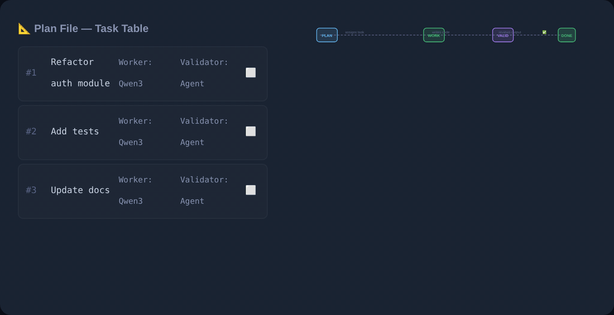

# `/wbWork` Documentation Hub

Welcome to the official documentation hub for `/wbWork` in **wb-flow**.



*The worker executes, a different agent validates, and a FAIL sends the row back to `⬜` rather than lowering the bar. `/wbWork` owns the left half of this loop.*


> [!TIP]
> **Running a wave costs the orchestrator's context.** `--summary` is already the default and saved a
> measured **63,002 tokens** on one 10-cell wave. For the rest of the levers — merged dispatches,
> `--list` before you spend, when `--sessions` helps and when it hurts — and for **who may root a run**
> (plus the temporary `codex` fallback when Claude is limited), see
> [`concepts/orchestrator_and_tokens`](../../concepts/orchestrator_and_tokens.md).

## Overview
`/wbWork` is the work execution engine of **wb-flow**. It executes tasks defined in your plan files (`plan_<scope>.md`), generates formal task reports (`task_<N>_report.md`), updates the `☐ Done` checkboxes, and dispatches parallel sub-agent wave jobs via `wb-flow wave`.


### 💡 `--as` Explanation Gate Behavior
- **Standard Invocations (without `--as`)**: Matrix task cells contain **ONLY** the direct execution command:
  ```markdown
  `/wbWork plan.md --id=B23`<br>→ *DeepSeek V4 Pro* *(⏱️ 15 min)*
  ```
- **Explanation-Enabled Invocations (with `--as="<style>"`)**: Matrix task cells prepend `/wbExplain`:
  ```markdown
  `/wbExplain plan.md --id=B23 --as="expert,steps"`<br>`/wbWork plan.md --id=B23`<br>→ *DeepSeek V4 Pro* *(⏱️ 15 min)*
  ```


### ⏱️ Wave Execution Session Tracking (`/wbTrack`)
Whenever `/wbWork` or `/wbPlan` is executed with the `--wave=<label>` flag, the execution pipeline automatically wraps the wave dispatches with session tracking:

```bash
# Executing /wbWork <path_scope> --wave=A follows this sequence:
1. /wbTrack <path_scope>   # Starts/joins today's session tracking log
2. wave_A.sh dispatches     # Executes parallel wave tasks
3. /wbTrack --stop          # Stops and finalizes session tracking log
```


### 🚀 Next Wave Execution Command Suggestions
Below the `## 🌊 Next Executable Sequence` matrix and Wave notes, `/wbPlan` and `/wbWork` output a dedicated recommendation block calculating total estimated duration (`Est. Time`) and offering ready-to-run CLI commands tailored for time and cost considerations:

- **Option 1 (Next Wave)**: `.wb/bin/wbRun claude -p --permission-mode auto "/wbWork plan.md --wave=A -y"`
- **Option 2 (With `--as`)**: `.wb/bin/wbRun claude -p --permission-mode auto "/wbWork plan.md --wave=A --as="expert,steps" -y"`
- **Option 3 (All Waves)**: `.wb/bin/wbRun claude -p --permission-mode auto "/wbWork plan.md --wave=all -y"`

## Flag Effects & Orchestration Capabilities
- **`--wave=<label>` / `-w`**: Activates wave mode. Launches collision-free matrix cells as background subshell tasks in parallel (`wave_A.sh`).
- **`--as="<style>"` / `-a`**: Explanation mode. Generates `/wbExplain` blueprint artifacts before task execution.
- **`--yes` / `-y`**: Autonomous mode. Auto-adopts recommended decisions for plan ambiguities and auto-spawns wave scripts without pausing.
- **`--worker="<models>"` / `-w`**: Overrides Worker fallback models (e.g. `--worker="DeepSeek V4 Pro,Kimi K3"`).
- **`--validator="<models>"` / `-v`**: Overrides Validator fallback models (e.g. `--validator="Gemini 3.5 Pro"`).
- **`--planner="<models>"` / `-p`**: Overrides Planner models.
- **`--mechanical="<models>"` / `-m`**: Overrides Mechanical helper models.

## Standard 9-File Documentation Suite
1. [`wbWork.md`](wbWork.md) — Complete `/wbWork` specification & flag matrix.
2. [`wbWork_eli5.md`](wbWork_eli5.md) — Simple plain-language explanation of wave execution.
3. [`wbWork_examples.md`](wbWork_examples.md) — Baseline invocations & single-task execution.
4. [`wbWork_examples.md`](wbWork_examples.md) — Exhaustive wave examples, `--as` blueprints, and per-role model overrides.
5. [`wbWork_exhaustive_simulation.md`](wbWork_exhaustive_simulation.md) — Step-by-step state trace of a multi-task wave execution.
6. [`wbWork_expert.md`](wbWork_expert.md) — Deep dive into `.wb/bin/wbRun` subshell error guarding & 80% token reduction.
7. [`wbWork_live_demo.md`](wbWork_live_demo.md) — Real terminal logs demonstrating fallback chains & visual banners.
8. [`wbWork_practical.md`](wbWork_practical.md) — Production recipes, CI/CD pipelines, and autonomous execution.


### ⏱️ Matrix Task Duration Estimations
In the `## 🌊 Next Executable Sequence` matrix table, each task dispatch cell appends the estimated task duration extracted from the task table's `Est. (min)` column, formatted as `*(⏱️ <min> min)*`:

```markdown
`/wbWork plan.md --id=B23`<br>→ *DeepSeek V4 Pro* *(⏱️ 15 min)*
```


### 💡 Pre-Flight Explanation Blueprint Gate (`--as`)
- **Standard Mode (default, without `--as`)**: Matrix cells contain **ONLY** the direct execution command:
  ```markdown
  `/wbWork plan.md --id=B23`<br>→ *DeepSeek V4 Pro* *(⏱️ 15 min)*
  ```
- **Explanation Mode (with `--as="<style>"`)**: Matrix cells prepend `/wbExplain`:
  ```markdown
  `/wbExplain plan.md --id=B23 --as="expert,steps"`<br>`/wbWork plan.md --id=B23`<br>→ *DeepSeek V4 Pro* *(⏱️ 15 min)*
  ```

## 🎛️ Universal model flags *(2026-08-01)*

| Flag | Alias | Effect |
|---|---|---|
| `--planner=` | `-p` | 🧠 Planner chain — **persists** via `/wbModel` |
| `--validator=` | `-v` | ✅ Validator chain — persists |
| `--worker=` | `-w` | 🔨 Worker chain — persists. ⚠️ `-w` is **not** `--wave` |
| `--mechanical=` | `-m` | 📋 Mechanical chain — persists |
| `--model=` | `-M` | **Delegate this run.** Highest priority: outranks role routing, the roster and the executor≠validator rule |
| `--wave=<L>:<R>` | `-W` | Run **one cell** — `:P` Planner · `:V` Validator · `:W` Worker · `:M` Mechanical |

```bash
/wbWork <folder>/ --wave="A:W" -M=$WORKER      # one cell, delegated
/wbValid <folder>/ --id="<i>" -v="go:ds4pro"           # persists the validator roster, then runs
```

Role flags are shorthand for running `/wbModel` first. An unknown role letter in `--wave` exits non-zero rather than silently running the whole row. **Precedence:** `-M` → role flag → plan-header roster → `model_recommendations.md` → defaults.

After the 🌊 matrix, a **copy/paste block** of bare runnable commands is printed — no table markup, no `<br>`, no duration annotations.
