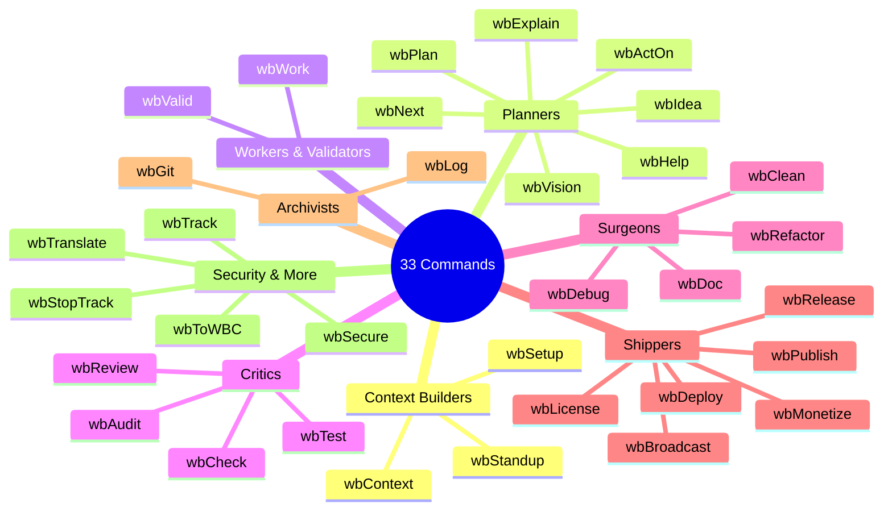

# Command Classification — The Four Roles

> This page defines the role taxonomy that governs every `/wb*` command. Each command is assigned exactly one role, which determines its permissions, output type, and position in the composition chain.

<div style="max-width:650px;margin:16px auto">



</div>

---

## The Four Roles

Every wb-flow command is classified into one of four roles:

| Role | Symbol | Permission | Output | Example Commands |
|---|---|---|---|---|
| **Planner** | 🧠 | Read code, read reports, write plans | Plan files with task tables | `/wbPlan`, `/wbIdea`, `/wbVision` |
| **Validator** | ✅ | Read reports, append scores | Validation scores (appended) | `/wbValid`, `/wbAudit` (re-run) |
| **Worker** | 🔨 | Read code, write code, write reports | Task reports, modified files | `/wbWork`, `/wbClean`, `/wbRefactor` |
| **Mechanical** | 📋 | Read reports, write summaries | Narrative text, commit messages | `/wbGit`, `/wbTrack`, `/wbStandup`, `/wbNext` |

---

## Role Definitions

### 🧠 Planner — "The Strategist"

**What it does:** Decomposes work into structured, executable task tables. Planners analyze the codebase and existing reports to generate prioritized backlogs.

**Key constraints:**
- Planners **never modify source code** — they only write `.md` plan files
- Every plan must include: task number, description, verification command, priority, worker suggestion
- Planners can create recursive sub-plans (task N → sub-tasks N.1, N.2, ...)

**When to use a Planner:**
- After an audit reveals technical debt
- When starting a new feature or refactor
- When an idea is promoted from the Ideas Pipeline

### ✅ Validator — "The Inspector"

**What it does:** Reviews completed work and assigns quality scores. Validators read task reports and verify acceptance criteria.

**Key constraints:**
- Validators **never modify source code or reports** — they only append validation scores
- Multiple validators can score the same task (cumulative)
- Validators should be a different model than the worker when possible
- Score range: 1–10. Below 7 typically triggers re-execution

**When to use a Validator:**
- After a task is marked ✅ Done
- Before a release (final quality gate)
- When a second opinion is needed on completed work

### 🔨 Worker — "The Executor"

**What it does:** Performs the actual work described in a plan task. Workers read code, modify code, and write task reports.

**Key constraints:**
- Workers **must have a plan task** to execute — they cannot work independently
- Workers write a task report documenting what was done
- Workers set the Done column to ✅ upon completion
- Only one worker can be the ultimate executor (overwrite rule)

**When to use a Worker:**
- When a plan task needs execution
- When code needs to be written, modified, or deleted
- When documentation needs to be authored (as in this content rewrite project)

### 📋 Mechanical — "The Narrator"

**What it does:** Produces narrative summaries, commit messages, and session logs. Mechanical commands are low-stakes, read-only operations.

**Key constraints:**
- Mechanical commands **never modify source code or plan state**
- Their output is ephemeral (useful for humans, not consumed by other commands)
- They can be run at any time without side effects
- They are the cheapest commands to run (low token usage)

**When to use a Mechanical command:**
- At the start of a session (`/wbTrack`)
- At the end of a session (`/wbStandup`, `/wbGit`)
- When deciding what to do next (`/wbNext`)

---

## The Role Decision Tree

```
Is the command creating a task backlog?
  YES → 🧠 Planner
  NO  → Is the command reviewing completed work?
          YES → ✅ Validator
          NO  → Is the command modifying source code or writing reports?
                  YES → 🔨 Worker
                  NO  → 📋 Mechanical
```

---

## Role vs. Plan Column Mapping

The `Requires` column in plan tables uses these same role symbols:

| Plan Column | Meaning |
|---|---|
| `🧠 Planner` | This task produces a sub-plan (recursive decomposition) |
| `✅ Validator` | This task validates another task's output |
| `🔨 Worker` | This task requires code or content execution |
| `📋 Mechanical` | This task produces a narrative summary |

---

## Full Command-to-Role Mapping

| Command | Role | Category |
|---|---|---|
| `/wbAudit` | 🧠 Planner (initial) / ✅ Validator (re-run) | Dual-role |
| `/wbPlan` | 🧠 Planner | Strategic |
| `/wbWork` | 🔨 Worker | Execution |
| `/wbValid` | ✅ Validator | Quality |
| `/wbClean` | 🔨 Worker | Execution |
| `/wbRefactor` | 🔨 Worker | Execution |
| `/wbGit` | 📋 Mechanical | Utility |
| `/wbTrack` | 📋 Mechanical | Utility |
| `/wbStandup` | 📋 Mechanical | Utility |
| `/wbNext` | 📋 Mechanical | Utility |
| `/wbHelp` | 📋 Mechanical | Utility |
| `/wbContext` | 🧠 Planner | Identity |
| `/wbIdea` | 🧠 Planner | Strategic |
| `/wbVision` | 🧠 Planner | Strategic |
| `/wbDebug` | 🔨 Worker | Execution |

---


## 🔗 Sister Edition

> The [Claude edition (`flow.wbc-ui.com`)](../../flow.wbc-ui.com/src/concepts/) <!-- [CROSS-EDITION] Phase=A --> covers the same concept in a self-help, opinionated register.

---

← [Concepts Hub](README.md) · [Home](../README.md)
