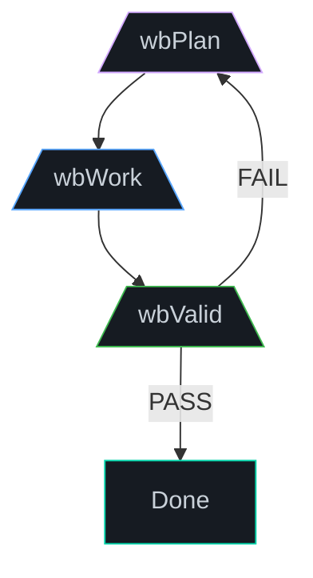

# Core Concepts & Architecture

The WB-Labs workflow is defined by two foundational architectures: **4D Temporal Navigation** and the **Smart Merge Protocol**.

## 1. 4D Temporal Navigation
Gone are the days of fragmented, model-specific subfolders. All agent outputs are unified under a strict temporal hierarchy:
`reports/<YYYY>/<MM>/<DD>/<type>/<type>_<target>_<YYYYMMDD>.md`

**Why?**
Instead of 20 fragmented files per day, we maintain 5-6 unified nodes. If multiple AI models all run an audit on `wb-core` today, they don't create three files. They append to **one** `audit_wb-core_<date>.md` file, creating a chronological progression of the system's health.

## 2. The Smart Merge Protocol
When multiple models target the same file (e.g., a shared `plan.md`), they follow the Smart Merge logic:
- **First Mover**: Creates the file and establishes the baseline structure.
- **Subsequent Actors**: Read the existing file and **append** their findings as a new section (e.g., `## Audit Entry #2 — (AI via API — 14:30)`).
- **Consensus Building**: If two models identify the same issue, the second model promotes it to a "Consensus Table" rather than blindly appending duplicates. Disagreements defer to the highest severity.

## 3. The Central JSON Registry
All command definitions are rigorously maintained in `frontEnd/wbc-ui/core2/packages/wb-flow/templates/commands/wb_commands_reference.json`. This is the ultimate source of truth for command routing, expected outputs, and chaining prerequisites.

## Key Principles

- **Context-first:** Every command starts by reading the project's current state
- **Idempotent operations:** Commands are safe to run multiple times
- **Composable pipelines:** Commands chain together via pipes and intermediate files
- **Layered documentation:** Each command has ELI5, Practical, Expert, Examples, and Simulation layers

## Related Concepts

- **[README.md](README.md)** — Full concepts index
- **[Commands](../commands/README.md)** — Command catalog organized by family
- **[Session Lifecycle](../session_lifecycle/README.md)** — How sessions work
- **[Daily Use](../daily_use/README.md)** — Daily operational procedures

## Related Pages

- [Concepts Index](README.md) — All concept pages
- [Commands](../commands/README.md) — Full command catalog
- [Session Lifecycle](../session_lifecycle/README.md) — How sessions work
- [Daily Use](../daily_use/README.md) — Daily operations

---

## 🔗 Sister Edition

> The [Claude edition (`flow.wbc-ui.com`)](../../flow.wbc-ui.com/src/concepts/) <!-- [CROSS-EDITION] Phase=A --> covers the same concept in a self-help, opinionated register.

---

← [Concepts Hub](README.md) · [Home](../README.md)
