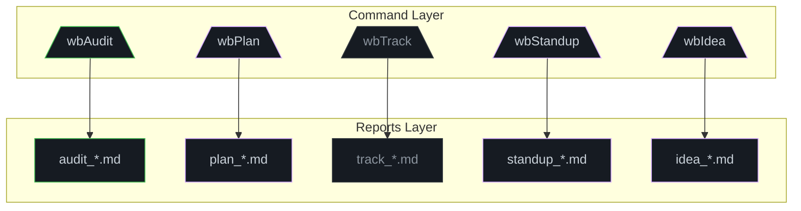

# The WB-Labs Workflow Lifecycle

<div style="max-width:650px;margin:16px auto">



</div>

Every work item in the WB-Labs agentic system follows a structured pipeline from discovery to deployment. This guide maps the complete lifecycle and explains how commands chain together.

## The 6-Phase Pipeline

```
┌─────────┐    ┌─────────┐    ┌─────────┐    ┌─────────┐    ┌─────────┐    ┌─────────┐
│  AUDIT  │───▶│  PLAN   │───▶│  WORK   │───▶│  VALID  │───▶│ RELEASE │───▶│DEPLOY   │
│ /wbAudit│    │ /wbPlan │    │ /wbWork │    │/wbValid │    │/wbRelease│   │/wbDeploy│
└─────────┘    └─────────┘    └─────────┘    └─────────┘    └─────────┘    └─────────┘
     │              │              │              │              │              │
     ▼              ▼              ▼              ▼              ▼              ▼
  audit_*.md    plan_*.md     task_N_*.md    plan_*.md     releases/      deploys/
                              (tasks_reports)(updated)    package.json   hosted app
```

### Phase 1: Audit — Discover

**Command:** `/wbAudit <target>`

The system scans code, docs, and configuration for issues: dead code, missing docs, security vulnerabilities, stale dependencies, architectural drift. Output is a scored audit report (`audits/audit_<target>_<date>.md`) with atomic findings numbered and prioritized.

See: [`/wbAudit` reference](../../commands/wbAudit/wbAudit.md)

### Phase 2: Plan — Decompose

**Command:** `/wbPlan <target>`

Each audit finding is decomposed into executable tasks with:
- Worker / Validator model assignments
- Priority (`P1`–`P4`) and estimated time
- Dependencies between tasks
- Verification commands

The plan file (`plans/plan_<target>_<date>.md`) becomes the single source of truth for the day's work.

See: [wbPlan flag reference](../wbPlan_flag.md), [Plan State Management](../plan_state_management_part1.md)

### Phase 3: Work — Execute

**Command:** `/wbWork <plan_file> --id=<N>`

A worker model picks up tasks and executes them mechanically: file edits, script runs, content generation. For each task, a report (`tasks/task_<N>/task_<N>_report_<target>_<date>.md`) is generated and the plan's `☐ Done` column is updated to `✅<br><worker_model>`.

Recursive tasks (marked `🔄 Recursive`) automatically expand into sub-tasks (e.g., 5.1, 5.2, 5.3) and are executed sequentially.

See: [`/wbWork` reference](../../commands/wbWork/wbWork_practical.md)

### Phase 4: Valid — Verify

**Command:** `/wbValid <plan_file> --id=<N>`

A validator model (different from the worker) peer-reviews the task report against the original task description. It assigns a 0–10 score and appends a validation block to the task report. The plan's `☐ Valid` column is updated.

This is the **gate** — only tasks with both `✅ Done` and `✅ Valid` are considered complete.

See: [`/wbValid` reference](../../commands/wbValid/wbValid_practical.md)

### Phase 5: Release — Package

**Command:** `/wbRelease <monorepo>`

Once all tasks in a plan are validated, `/wbRelease` resolves version dependencies across packages, bumps semantic versions, and generates release notes. It prepares the monorepo for publication.

See: [`/wbRelease` reference](../../commands/wbRelease/wbRelease.md)

### Phase 6: Deploy — Ship

**Command:** `/wbDeploy <target>` or `/wbPublish <target>`

The final build and deployment step. `/wbPublish` handles NPM package publication; `/wbDeploy` orchestrates web host deployments (Vercel, AWS, VPS).

See: [`/wbDeploy` reference](../../commands/wbDeploy/wbDeploy.md), [`/wbPublish` reference](../../commands/wbPublish/wbPublish.md)

---

## Supporting Commands (Woven Throughout)

| Command | Role in the Workflow |
|---|---|
| `/wbContext` | **Before Phase 1:** Rebuilds the target's identity snapshot (`context.md`) from live code, so the audit has accurate baselines. |
| `/wbCheck` | **Before Phase 3:** A pre-flight quiz that verifies the worker model understands the codebase before acting. |
| `/wbExplain` | **Any phase:** Generates persistent pedagogical explanations for a specific task ID to onboard new models. |
| `/wbTrack` | **Entire session:** Logs every action into a chronological narrative (`track_<target>_<date>.md`) for traceability. |
| `/wbStandup` | **Between sessions:** Aggregates stale tasks, open audits, and failed validations into a morning standup report. |
| `/wbNext` | **Between phases:** Suggests the optimal next command based on the current state of reports. |
| `/wbGit` | **After Release:** Generates a Conventional Commit message from the day's progression. |

---

## The Daily Rhythm

The workflow above maps to a daily cycle. See [The Daily Playbook](../../daily_use/the_daily_playbook_part1.md) for the hour-by-hour breakdown and [Sequencing Work Items](sequencing_work_items_part1.md) for advanced dependency management strategies.

## Recursive Workflow (Sub-Plans)

When an audit finding is too large for a single atomic task, `/wbPlan` creates a **recursive task**. This triggers a nested workflow:

1. The recursive parent (e.g., Task 5) is expanded into a sub-plan with child tasks (5.1, 5.2, 5.3, 5.4).
2. Each child task follows the same Audit → Plan → Work → Valid → Release pipeline.
3. The parent is marked `✅ Expanded → 5.1, 5.2, ...` once all children are validated.

```bash
# Expand a recursive task into sub-tasks
/wbPlan plan_core2_20260503.md --id=5

# Execute all children of the recursive task
/wbWork plan_core2_20260503.md --id=5     # Auto-executes 5.1, 5.2, 5.3, 5.4

# Validate all children
/wbValid plan_core2_20260503.md --id=5    # Auto-validates 5.1, 5.2, 5.3, 5.4
```

## State Machine Reference

| State | `☐ Done` / `☐ Valid` | Meaning |
|---|---|---|
| Open | `⬜` | Ready for execution. |
| Executed | `✅<br><model>` | Worker completed; awaiting validation. |
| Validated | `✅ <N>/10<br><model>` | Validator passed. Task is complete. |
| Deferred | `⏸️ Deferred` | Intentionally postponed. |
| Cancelled | `🚫 Cancelled` | No longer relevant. |
| Blocked | `🔄` / `🔄 Recursive` | Blocked by dependency; or a recursive parent. |

State manipulation is done via CLI flags on `/wbPlan`, `/wbWork`, or `/wbValid`. See [Plan State Management](../plan_state_management_part1.md) for the full reference.
