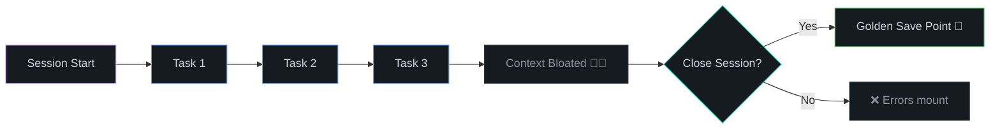

# Closing the Session

## Why Close a Session?
AI Agents have a "context window." As you chat, the window fills up with old logs, executed code, and discarded thoughts. If a session gets too long, the AI becomes "bloated"—it starts hallucinating, forgetting instructions, and costing more tokens per message.

When you hit a [Golden Save Point](1_the_golden_save_point.md), or when you finish working for the day, you must formally close the session to keep the AI sharp.

## How to Close the Session (SOP)

1. **Snapshot the Day**: 
   Run `/wbStandup <target>`
   *Why?* This aggregates all the work you just finished and creates a neat, machine-readable summary in the `reports/<YYYY>/<MM>/<DD>/standups/` folder.

2. **Finalize the Tracker**:
   Run `/wbStopTrack --finalize`
   *Why?* This tells the AI to cleanly close out the active `track_<target>_<YYYYMMDD>.md` file. It will summarize any major decisions and mark the file's status as `🔴 CLOSED`.

3. **Purge the Context (The Human Step)**:
   **Close the actual chat window/thread in your AI interface.** 
   *Why?* This is the physical act of clearing the AI's short-term memory. The next time you open a chat, the AI will be fresh, fast, and unburdened by past tokens. It will rely purely on the written `context.md` and your `reports/` folder.

## Why Formal Closure Matters

Closing a session formally ensures that the AI tracker has an accurate record of what was accomplished, what decisions were made, and what the next steps are. It prevents context bleed between sessions and gives the next session a clean starting point.

## Related Concepts

- **[The Golden Save Point](1_the_golden_save_point.md)** — The ideal state before closing
- **[Opening a New Session](3_opening_a_new_session.md)** — Starting fresh after closure
- **[Session Lifecycle Hub](README.md)** — Full lifecycle overview

## Summary

Closing a session formally captures the work done, decisions made, and next steps. It prevents context bleed and ensures the next session starts with a clean slate.

## Checklist

- [ ] All tasks marked Valid
- [ ] Changes committed to git
- [ ] Session tracker stopped
- [ ] Standup generated and shared

## Related

- [The Golden Save Point](1_the_golden_save_point.md) — Prerequisite for closing
- [Opening a New Session](3_opening_a_new_session.md) — Next step after closing

---
← [Session Lifecycle Hub](README.md) · [Home](../README.md)

