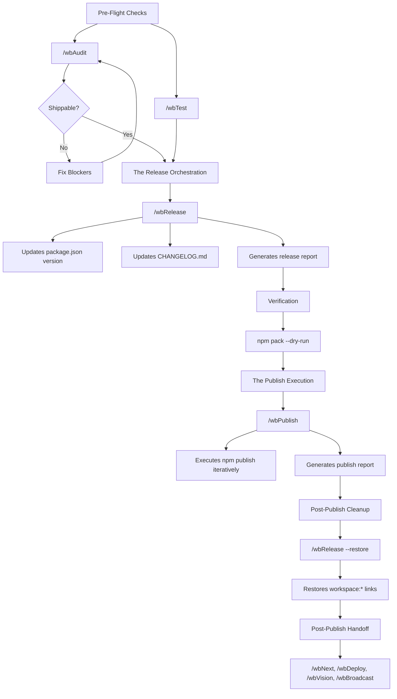

# wb-flow Publishing Lifecycle

This section outlines the natural, deterministic process for publishing a package using the `wb*` command system. It covers the end-to-end lifecycle from pre-flight checks to post-publish procedures.

## Publishing Lifecycle Diagram

## Step-by-Step Guide

### 1. Pre-Flight Checks
Before releasing any package, you must ensure the code is clean and tested.
* **Run `/wbAudit <pkg>`**: The AI will verify there are no `P0` (Blocker) findings and that the package scores high enough to be "Shippable". This generates an `audit_*.md` report.
* **Run `/wbTest <pkg>`**: Ensures all unit and smoke tests pass.

### 2. The Release Orchestration
This step modifies the necessary files to prepare them for NPM publication.
* **Run `/wbRelease <pkg>`** (e.g., `/wbRelease core2/packages/wb-flow/`).
* **What it does**: 
  * Scans recent audits and commits.
  * Decides on the version bump (Patch/Minor/Major) via Conventional Commits.
  * Updates `CHANGELOG.md`.
  * Replaces all local `file:../../` or `workspace:*` dependencies inside `package.json` with the real upcoming NPM versions.
* **Outputs**: `release_<target>_<date>.md`

### 3. Verification & Tarball Check
* Manually run `npm pack --dry-run` to inspect the tarball contents and guarantee you aren't accidentally shipping internal files like `.env` or `node_modules/`.

### 4. The Publish Execution
This step pushes the package to the npm registry.
* **Run `/wbPublish <pkg>`**
* **What it does**: 
  * Builds the production assets (if required).
  * Iteratively executes `npm publish` following the topological order defined in the release plan.
* **Outputs**: `publish_<target>_<date>.md`

### 5. ⚠️ Post-Publish Cleanup (Critical)
* **Run `/wbRelease <pkg> --restore`**
* **Why it matters**: If skipped, your `package.json` files remain permanently pinned to public NPM registry versions. The `--restore` flag puts the local `workspace:*` links back where they belong, so your local development isn't broken.

### 6. Post-Publish Handoff
Once the product is published, you handle the ripple effects. Run these commands based on your needs:
* **`/wbNext` or `/wbStandup`**: Re-sync the team and figure out what to do next.
* **`/wbDeploy <consumer-app>`**: Use this to deploy consumer applications or documentation sites (e.g., `flow.wbc-ui.com`) that need the newly published package.
* **`/wbVision <pkg>`**: Re-assess the overall project roadmap and architectural goals now that a milestone is reached.
* **`/wbBroadcast <pkg>`**: Notify stakeholders or downstream consumers about the new release and its changelog.

---
← [Session Lifecycle Hub](README.md) · [Home](../README.md)

