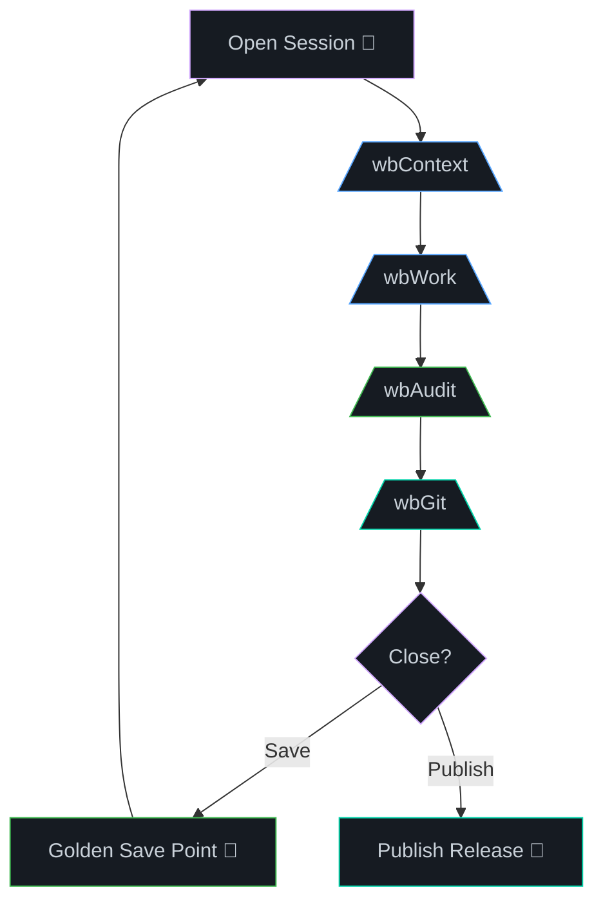

# Session Lifecycle —

<div style="max-width:650px;margin:16px auto">



</div>

AI agents have finite context windows. Managing sessions — when to open, when to close, and how to save state between them — is critical to avoiding hallucinations, token bloat, and lost work.

## Index

| File | Coverage |
|---|---|
| [1_the_golden_save_point.md](1_the_golden_save_point.md) | Recognizing and leveraging the pristine repository state — all tasks validated, no tech debt |
| [2_closing_the_session.md](2_closing_the_session.md) | The SOP for formal session closure: standup snapshot, tracker finalization, context purge |
| [3_opening_a_new_session.md](3_opening_a_new_session.md) | Safe session opening protocol, including the "Same Day" edge case (cumulative appending) |

## The Lifecycle at a Glance

```
┌──────────────────┐
│  GOLDEN SAVE     │  All tasks validated. No debt. Clean `context.md`.
│  POINT REACHED   │
└────────┬─────────┘
         │
         ▼
┌──────────────────┐
│  1. /wbStandup   │  Snapshot the completed work.
│  2. /wbStopTrack │  Finalize the session log.
│  3. Git commit   │  Commit the clean state.
│  4. Close chat   │  Purge AI context.
└────────┬─────────┘
         │
         ▼
┌──────────────────┐
│  NEW SESSION     │  Fresh chat window.
│  1. /wbTrack     │  Initialize new tracker.
│  2. /wbContext   │  Rebuild identity.
│  3. Resume work  │  Start the daily playbook.
└──────────────────┘
```

## When to Save vs. When to Keep Going

| Scenario | Action |
|---|---|
| All plan tasks `✅ Valid` | **Golden Save Point** — close session, commit |
| Some tasks still `⬜` | Keep working. Don't close yet. |
| Context feels bloated (slow responses, hallucinations) | Close session even if work isn't finished. The standup will surface unfinished tasks in the next session. |
| End of day | Always close. Always commit. |
| Mid-feature, but hitting a natural milestone | Close and commit. Treat the milestone as a mini save point. |

## The "Same Day" Edge Case

If you close a session and open a new one on the same day, the system handles it gracefully:

- All `/wb*` command outputs use **exactly the same filenames** (e.g., `track_core2_20260503.md`).
- Instead of overwriting, the system **appends** new entries with timestamp headers.
- No data loss. No versioned suffixes. One file per day, cumulative.

See [3_opening_a_new_session.md](3_opening_a_new_session.md) for the detailed protocol.

---

← [Home](../README.md) · [Commands](../README.md#the-command-catalog) · [Install](../../README.md) | [@wbc-ui2/wb-flow on npm](https://www.npmjs.com/package/@wbc-ui2/wb-flow) · [flow.wbc-ui.com](https://flow.wbc-ui.com) · [wi-bg.com](https://www.wi-bg.com)
